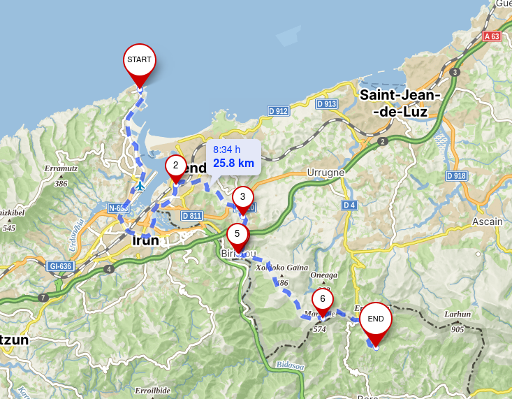
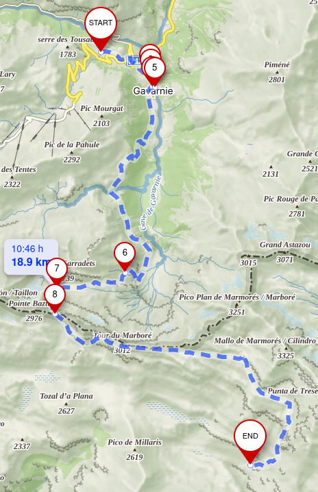

on summer of 2024 I challenged myself into new adventure. crossing the pyrenees mountains by foot in less than 30 days. First of all, I'll sadly make it clear that I couldn't finish it . However, being my first time in such a journey alone was mesmerizing.

My goal was to complete the 700/800km following GR10/HRP/GR11.

Here go some highlights and stories.

### Day 0

my journey started from `Alicante, Spain`. I took a train all the way to the west of the Pyrenees to the starting town of `Irún`. I got there at around 12AM on the last arriving train to the station. I had some hours before starting so I walked to the **lighthouse** 5/6km away where I hoped to find a spot to sleep for a couple hours until sunrise.

At the foot of the lighthouse I got comfortable in a hidden spot and rested until it was not dark.

### Day 1

Route details

| Start | End  | Distance |
| :---- | :--- | :------- |
| Irún  | Bera | 25.8 km  |

I woke up to a beautiful sunny day next to `Faro de Higuer`.

Quickily, I packed the couple things I used at night and began walking following the very first **red marking** and continuing towards `Hondarribia`.

At 1pm it was really warm and after a very long day I found a quiet place to set camp and fell asleep out of exhaustion.

### Day 2

Route details

| Start | End      | Distance |
| :---- | :------- | :------- |
| Bera  | Elizondo | 34.6 km  |

Next day I on route again at 8am. My next destionation was `Elizondo`.

Having walked around 35km from the coast the landscape changed a lot and helped to combat the warm weather.

I arrived at `Elizondo` and stayed at a hostel on a solo room for a reasonable price.

### Day 3

Route details

| Start    | End      | Distance |
| :------- | :------- | :------- |
| Elizondo | Saroizar | 39 km    |

I continued passed `Roncesvalles` and at one point I left the trail for a few meters into the forest and setup camp for the night.

### Day 4

Route details

| Start    | End       | Distance |
| :------- | :-------- | :------- |
| Saroizar | Ochagavía | 38.4 km  |

That morning the rain woke me up. Even if it was just a little chilly, my body was still getting used to it coming from the warm weather of the Mediterranean coast.

I put on my **poncho** and started the day by walking towards a little town. Little did I know this would be the most weather intensive day of the entire trip.

Once there I stopped for filling my waterbottle and followed a trail that went up a foggy mountain. Some hours later I was inside a dense fog which indeed wasn't bad at all.

At some point I took a turn and so did the weather, as a strong and cold wind started blowing. I was still walking when I saw in from of me two sillouettes approaching. Two women which I talked to for some minutes and told me to not get the common route given the bad weather. I arrived to a crossroad and did what the women adviced me and follow the road.

Eventually I left the foggy and windy weather behind and finally arrived to `Ochagavía` and stayed the night at a camping.

### Day 5

Route details

| Start     | End        | Distance |
| :-------- | :--------- | :------- |
| Ochagavía | Petraficha | 31.4 km  |

I woke up to a nice sunny day. Today's goal was `Isaba` and to continue pass it. It was a long day.

Passed Isaba and stayed beside its river chilling a bit when I noticed it was getting a little late. I continued and at 20PM I arrived to my tonight's shelter, and I was not alone. A german guy was setting up his tent next to the cabin.

### Day 6

Route details

| Start      | End       | Distance |
| :--------- | :-------- | :------- |
| Petraficha | Candanchú | 26.8 km  |

I woke up late to the german guy leaving the camp. I later followed after him and met one last time at a valley.

We parted ways and I set my course towards `Candanchú`.

At arrival I quickily took a cold drink and booked a room at the hostel. Candanchú was located in a ski area so there was plenty of shelter. I ate a nice steak and went to bed.

### Day 7

Route details

| Start     | End               | Distance |
| :-------- | :---------------- | :------- |
| Candanchú | Caillou de Soques | 20.5 km  |

I spent the night throwing up (sorry to my room mates). I suspected I drank bad water two days prior, and now it was first hour of the day and couldn't put myself together to start walking. Every step was a struggle, my body felt really weak.

I kept going somehow, the `Balaïtous` at the distance and finally the day came of an end at this rugged shelter. I hadn't achieved the set daily goal by some kilometers. However, now the focus was on recovering fast as I felt devastated and wondering how I was going to make it the next days.

### Day 8

I rested +10h and still woke up with a bad trip. I needed a hot shower and good rest at least one night. This day didn't go very well. I kept walking some hours, even did autostop at some point due to my inability to continue progressing.

I got off route and by 12pm I got a bus to at `Sallent de Gállego` to check at the doctor and rest for one night. A zero day.

### Day 9

Route details

| Start              | End           | Distance |
| :----------------- | :------------ | :------- |
| Sallent de Gállego | Refuge Wallon | 20.8 km  |

I woke up better, but not fully strong. The stomach ache was milder. I decided to continue the hike. I got on a bus again and stopped at the place I had left the day before.

I continue towards `France` to my next destination passing by some shelters like `Respomuso`.

At the top of this mountain and some distance left ahead of me, I was feeling really thirsty from the bad water still. Thirst was _killing me_. Finally I arrived, late in the day to `Wallon`.

### Day 10

Route details

| Start         | End      | Distance |
| :------------ | :------- | :------- |
| Refuge Wallon | Gavarnie | 28 km    |

Morale was low as I couldn't myself completing the thru hike. Despite all, I kept going.

Crossing behind the north face of the `Vignemale`.

I arrived to `Gavarnie` and stayed at a hostel.

### Day 11

Route details

| Start    | End   | Distance |
| :------- | :---- | :------- |
| Gavarnie | Góriz | 22 km    |

Today was my last and most enjoyable day. The landscapes were stunning.

I left `Gavarnie` and enjoyed the beautiful `Cirque de Gavarnie` with its waterfall.

It was a harsh walk all the way to the top but finally made it.

Now it was turn to get to `Góriz`, where I camped outside as it was fully booked.

### Day 12

Route details

| Start | End    | Distance |
| :---- | :----- | :------- |
| Góriz | Bielsa | 22.8 km  |

I arrived woke up to a bunch of people early starting the climb to `Monte Perdido`.

I crossed `Añisclo` and through the `Refugio de Pineta` all the way to `Bielsa` where I spent the night and got in a car back home the next day.

### Thoughts

The trip was amazing. I met incredible people. I got the best of emotions and some frustating moments. Overall it was great and I wish continuing thru hiking.
