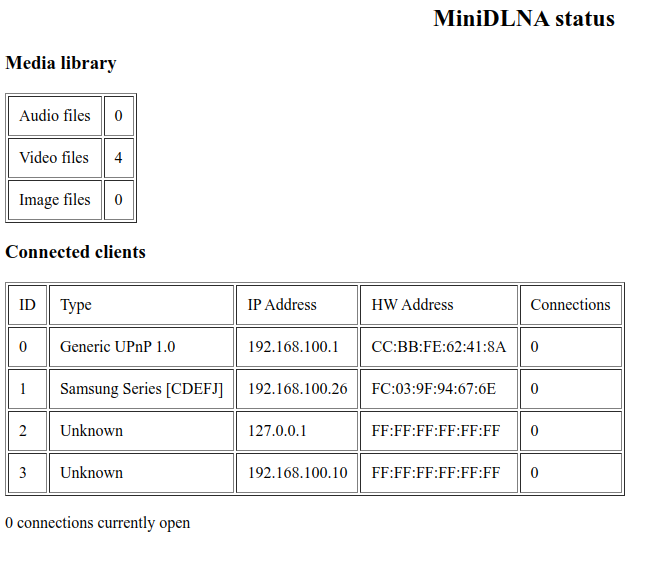
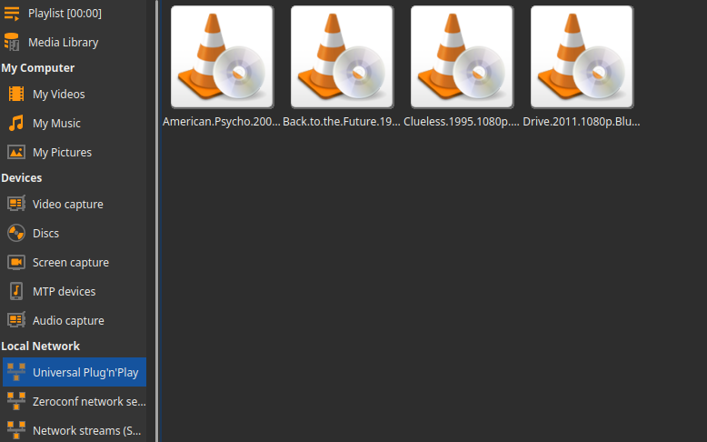

I'll be setting up a DLNA server on my Arch Linux machine to stream movies to my smart tv over my home network.

### What is this?

If you don't know what DLNA is, I'll explain briefly. It was introduced in 2004 (20 years ago :O) and its purpose is to stream media files to other devices in the same network. It uses UPnP for media and device discovery.

### Tutorial

I'll be using the tool [minidlna](https://sourceforge.net/projects/minidlna/) for its simplicity and following the [guide](https://wiki.archlinux.org/title/ReadyMedia) in Arch Linux forums. So I will be using my own user and OpenRC, taking that into consideration. For that, create the config file in `.config` directory
.

```sh
install -Dm644 /etc/minidlna.conf ~/.config/minidlna/minidlna.conf
```

Then edit it to specify my user, which is the one I use commonly. You can set multiple media directories. I'll be just setting my `Videos` dir where I store my downloaded movies. The `V,` prefix indicated it is a video only folder.

```sh
user=$USER
media_dir=V,/home/$USER/Videos
db_dir=/home/$USER/.cache/minidlna
log_dir=/home/$USER/.config/minidlna
```

This little snippet inside the conf file explains it better:

```sh
# * if you want multiple directories, you can have multiple media_dir= lines
# * if you want to restrict a media_dir to specific content types, you
#   can prepend the types, followed by a comma, to the directory:
#   + "A" for audio  (eg. media_dir=A,/home/jmaggard/Music)
#   + "V" for video  (eg. media_dir=V,/home/jmaggard/Videos)
#   + "P" for images (eg. media_dir=P,/home/jmaggard/Pictures)
#   + "PV" for pictures and video (eg. media_dir=PV,/home/jmaggard/digital_camera)
```

Finally, run it:

```sh
minidlnad -f /home/$USER/.config/minidlna/minidlna.conf -P /home/$USER/.config/minidlna/minidlna.pid -d
```

I append the `-d` flag so it doesn't daemonize, but that's just my preference of course.

You can visit `http://192.168.100.10:8200/` (change it to your local IP) for a quick look at the discovered files and hosts.



My Smart TV talks to the server automatically.

I can check the files are found from the UPnP section in VLC.



### Subtitles

DLNA supports subtitles as well. The way I figured it out to work was saving the `.srt` file with the video file's name. i.e. your video is called `American.Psycho.2000.UNCUT.REMASTERED.1080p.BluRay.H264.AAC-LAMA.mp4` so your subtitle file should be `American.Psycho.2000.UNCUT.REMASTERED.1080p.BluRay.H264.AAC-LAMA.srt`. Notice how the extension is the only difference. Store both files in the same directory.
